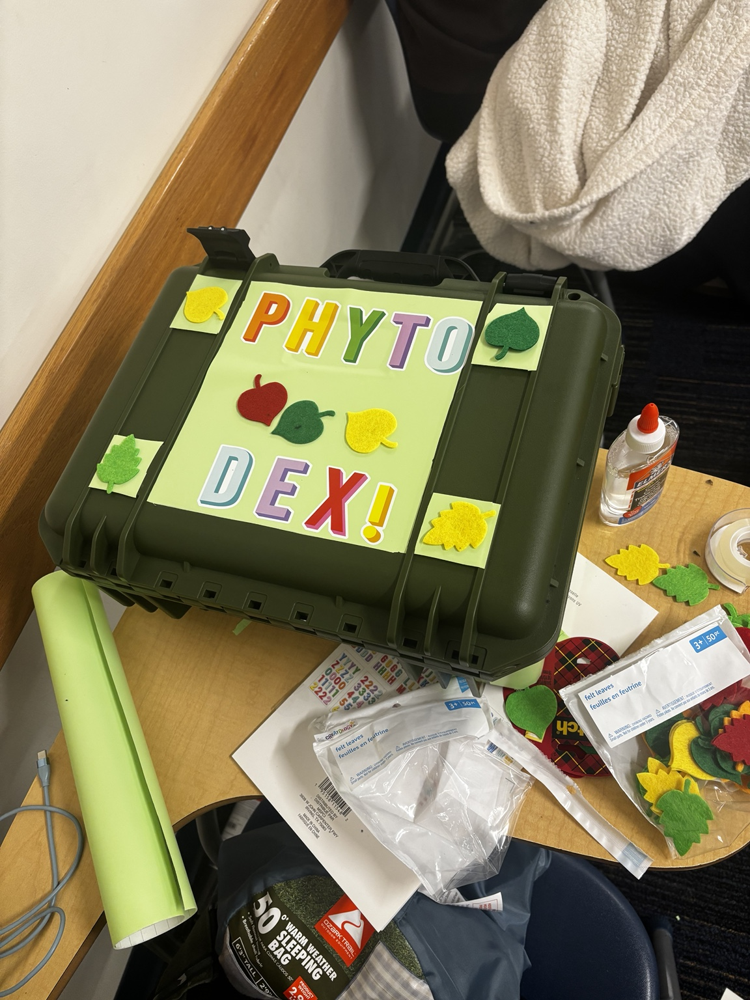
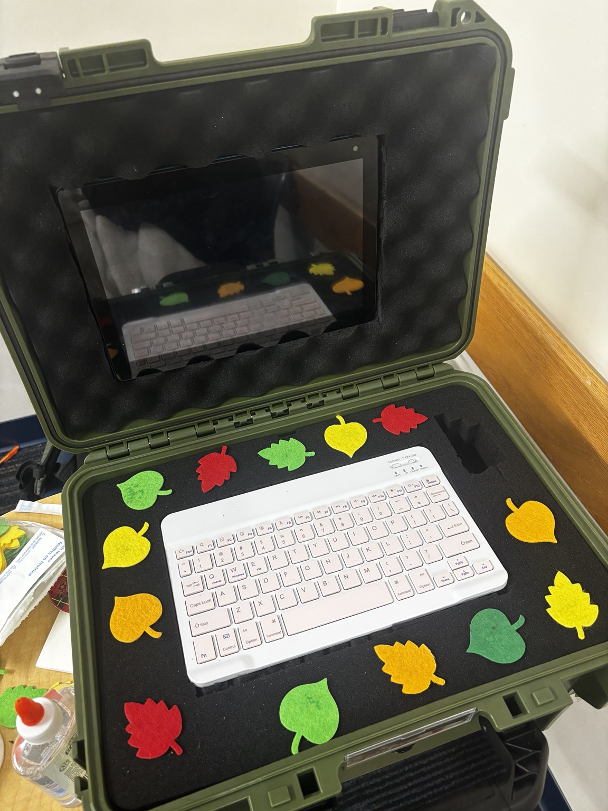

# PhytoDex

**A portable botanical cyberdeck.** PhytoDex is a Raspberry Pi built into a carry case with a tablet screen, a compact keyboard and a USB camera. Point it at a plant, and it describes what it can see on the leaves, keeps a dated photo history of each plant you own, and answers plant-care questions.

Built at ShellHacks 2026.

<p align="center">
  
  
</p>

## What it does

- **Scan a plant.** Take a photo with the deck's USB camera (with live preview), the tablet's camera, or the photo library. Gemini returns a plant name, a health rating, the visible signs, possible causes, next steps and the limits of what one photo can show.
- **My Garden.** Save a scanned plant with a nickname. Rescan it later, and each scan is added to its dated history with a side-by-side "previous vs latest" view. Earlier scans are never overwritten.
- **PlantDex.** A built-in library of 15 common houseplants, each with a photo and care profile (water, light, soil, temperature, difficulty).
- **Ask Phyto.** Describe a problem in words and get likely causes, what to check, and recommended actions.
- **System.** Live status of the deck: hardware, CPU temperature, uptime, network addresses, database, camera and AI mode.

### Honest by design

- **No made-up scores.** Certainty is shown as low, medium or high evidence, never a percentage.
- **Clear offline answers.** If Gemini is unavailable, photo analysis says so instead of guessing. Ask Phyto's offline answer is clearly labeled as a general checklist.
- **No guessed species.** Gemini's plant name is only a suggestion. A garden plant is linked to a PlantDex species only when you choose one, and you can save a plant with no species at all.

## How it works

```
Tablet browser  ──Wi-Fi──▶  Raspberry Pi (Flask + Waitress)
                               ├── SQLite database (plants, garden, photos, scan history)
                               ├── USB camera (fswebcam for photos, FFmpeg for live preview)
                               └── Gemini API (photo analysis and Ask Phyto, over the internet)
```

The Pi hosts everything: the web interface, the API, the database and the stored photos. The tablet just opens a web page. Gemini runs in Google's cloud, so photo analysis and live Ask Phyto answers need an internet connection and a Gemini API key. Everything else works offline.

## Hardware

- Raspberry Pi running Raspberry Pi OS (any recent model that runs Python 3.11 or newer)
- USB webcam (V4L2 compatible)
- Tablet or phone with a modern browser, on the same network as the Pi
- Optional: compact keyboard and a case to make it a deck

## Quick start

These steps work on the Pi or on a laptop for development. Requires **Python 3.11+**.

```bash
git clone https://github.com/cnaraysingh05/PhytoDex.git
cd PhytoDex

python3 -m venv .venv-ai
source .venv-ai/bin/activate
python -m pip install -r requirements-dev.txt

python scripts/init_database.py     # creates the database and the PlantDex library
python scripts/configure_ai.py      # optional: stores your Gemini key privately in .env.ai
python app.py
```

Open **http://127.0.0.1:5001** on the same machine.

`configure_ai.py` asks for your key without showing it on screen. Press Enter at the key prompt to stay in offline mode. To confirm a live connection, run `python scripts/check_ai.py`. Restart the app after changing the configuration.

### On the Raspberry Pi

Install the camera tools once:

```bash
sudo apt update
sudo apt install fswebcam ffmpeg
```

The app only accepts connections from the Pi itself by default. To use it from a tablet:

```bash
hostname -I                  # note the first address, e.g. 192.168.1.42
HOST=0.0.0.0 python app.py
```

Then open **http://192.168.1.42:5001** on the tablet, using your Pi's address and `http://`, not `https://`. The header shows whether the tablet can reach the deck. Refreshing any screen works.

**Tip:** in the tablet browser, use **Add to Home Screen** so PhytoDex opens like an app.

## Configuration

Settings go in a private `.env.ai` file in the project folder (see `.env.ai.example`). It is ignored by Git, so your key never ends up on GitHub.

| Variable | Purpose | Default |
|---|---|---|
| `AI_MODE` | `gemini` for live AI, `offline` for none | `offline` |
| `GEMINI_API_KEY` | Your Gemini API key | empty |
| `GEMINI_MODEL` | Gemini model name | set by `configure_ai.py` |
| `HOST` | Address to listen on; use `0.0.0.0` for tablet access | `127.0.0.1` |
| `PORT` | Port number | `5001` |
| `PHYTODEX_DB_PATH` | Database file location | `database/phytodex.db` |
| `PHYTODEX_CAPTURE_DIR` | Where photos are stored | `static/uploads/captures` |
| `PHYTODEX_CAMERA_DEVICE` | Camera device path | first USB camera, else `/dev/video0` |

## Using PhytoDex

| Screen | What you can do |
|---|---|
| **Home** | Choose Scan a plant or My Garden |
| **Scan** | Use the deck camera (with live preview) or a tablet photo, then analyze it |
| **Scan result** | Read the assessment and save the plant to My Garden with a nickname |
| **My Garden** | See every saved plant with its latest rating |
| **Plant page** | Compare previous and latest scans, browse the full history, rescan, or remove the plant |
| **PlantDex** | Search the plant library and read care profiles |
| **Ask Phyto** | Ask a plant-care question in words (up to 3,000 characters) |
| **System** | Check the deck's hardware, network, database, camera and AI status |

**Photo tips:** photograph the whole plant plus any affected leaves in good, even light. For rescans, try to match the angle and lighting of the earlier photo; lighting alone can change how a plant looks. On an iPhone or iPad, set **Settings > Camera > Formats** to **Most Compatible** if a photo won't open.

## API

All routes return JSON. Full details are in [docs/CONTRACT.md](docs/CONTRACT.md) and [docs/PHOTO_DIAGNOSIS.md](docs/PHOTO_DIAGNOSIS.md).

| Method | Route | Purpose |
|---|---|---|
| GET | `/api/health` | Server is running |
| GET | `/api/system` | Deck hardware, network, database and AI status |
| GET | `/api/plants`, `/api/plants/<id>` | PlantDex library (`?q=` to search) |
| GET, POST | `/api/garden` | List saved plants, or save one (`nickname`, optional `plant_id`) |
| DELETE | `/api/garden/<id>` | Remove a saved plant (its photos and scans are kept, unlinked) |
| GET | `/api/garden/<id>` | One plant with its scan history and comparison |
| GET | `/api/garden/scan-summaries` | Scan count and latest scan for each plant |
| POST | `/api/garden/<id>/scans` | Add a photo's scan to that plant (`capture_id`) |
| POST | `/api/capture` | Upload a photo (form field `image`) |
| GET | `/api/camera/status` | Whether the USB camera and its tools are available |
| GET | `/api/camera/preview` | Live camera stream (stores nothing) |
| POST | `/api/camera/preview/stop` | Stop the live stream |
| POST | `/api/camera/capture` | Take and store a photo with the USB camera |
| POST | `/api/analysis` (alias `/api/identify`) | Analyze a photo (`image` upload or `capture_id`) |
| POST | `/api/assistant` | Ask Phyto (`message`, optional `species`) |

Photo analysis returns `plant_name`, `health_rating` (healthy, attention, concerning or unknown), `visible_signs`, `possible_causes`, `next_steps`, `certainty` (low, medium or high), `limitations` and `source`.

Error codes:
- **400:** bad input or an unreadable photo
- **404:** photo not found
- **503:** AI not configured, or camera unavailable
- **502:** Gemini or camera failure

## Tests

```bash
python -m pytest -q
python scripts/check_readiness.py --require-team
```

The test suite (116 tests) uses fake Gemini responses and temporary databases, so it needs no API key, internet or camera. GitHub Actions runs it on Python 3.11, 3.12 and 3.13 for every push and every pull request into `main` or `main.test`.

To check one real photo against the live Gemini API:

```bash
python scripts/check_photo.py --image data/samples/sample_leaf.jpg --live
```

## Project structure

```
app.py                  Flask app; run this to start PhytoDex
analysis/               Photo pipeline: preprocessing, Gemini classifier, diagnosis
backend/routes/         API routes and the page server for the web interface
backend/services/       Assistant, scan history, system status, USB webcam
backend/models/         SQLite connection and database migrations
database/               Schema and PlantDex seed data
templates/, static/     Web interface: HTML, CSS, JavaScript, images
scripts/                Setup, configuration and check tools
tests/, tests_ai/       Automated tests
docs/                   API contract and integration notes
ml/, notebooks/         Experimental local-model training (not used by the app)
```

## Privacy and data

- **Photos:** stored on the Pi in `static/uploads/captures/`. A photo is sent to Google's Gemini API only when you analyze it.
- **Ask Phyto:** questions are saved in the deck's database, so leave out private details.
- **Kept out of GitHub:** the Gemini key, the database, database backups and uploaded photos are all listed in `.gitignore`.

## Troubleshooting

| Problem | Try this |
|---|---|
| Tablet can't open the page | Start with `HOST=0.0.0.0`, confirm both devices are on the same Wi-Fi, and use port `5001`. Some guest or school networks block device-to-device traffic; a phone hotspot is a good fallback. |
| "Photo analysis isn't set up" | Run `python scripts/configure_ai.py`, then restart the app |
| "Gemini is unavailable" | Check the Pi's internet connection, then try again. The photo is kept, so you don't need to retake it. |
| Deck camera unavailable | Install `fswebcam` and `ffmpeg`, check the USB connection, or set `PHYTODEX_CAMERA_DEVICE` |
| Old data after an update | Stop the app and run `python scripts/init_database.py` again. It upgrades the database, making a backup first, and never deletes your plants. |

## Limitations

- Photo analysis describes what one photo shows. It can't test soil, roots or moisture, and it isn't a substitute for an expert diagnosis.
- Live AI features need internet access and a Gemini API key.
- The app uses a plain `http://` connection on the local network and has no user accounts. Run it on a network you trust.
- The local TensorFlow Lite training material in `ml/` and `notebooks/` is experimental and not connected to the app.

## License

MIT. See [LICENSE](LICENSE).
